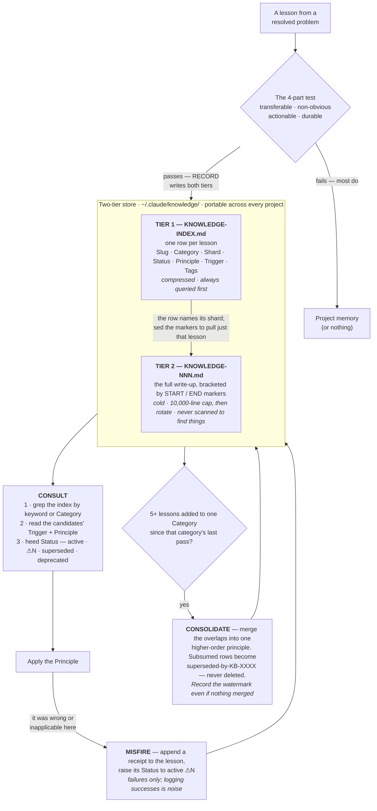
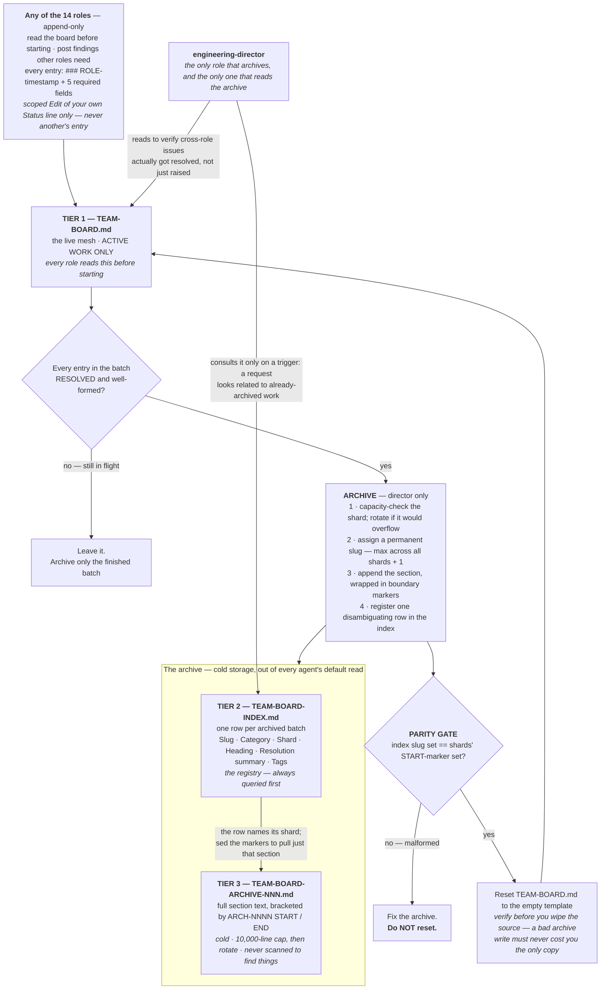
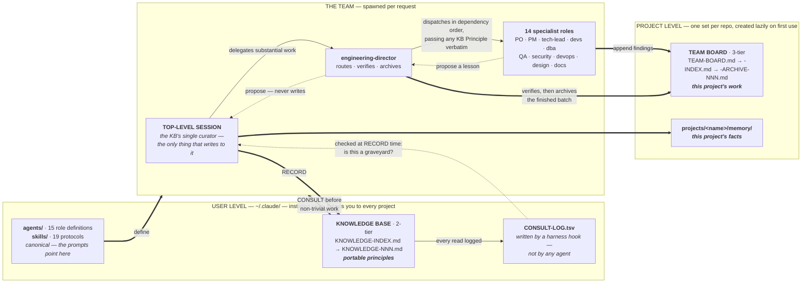

# Agentic Architecture

A complete, working **14-role AI dev team** for [Claude Code](https://claude.com/claude-code) — plus the two systems that keep it from drowning in its own output: a **self-compressing knowledge base** and a **three-tier team-board archive**.

This is not a prompt collection. It's an org chart with escalation rules, a mesh communication layer, and a memory system that gets *denser* as it grows instead of just bigger.

```
                          engineering-director
                         /          |          \
                product-owner  project-manager  tech-lead
                                                    |
        ----------------------------------------------------------------
        |                    |          |             |               |
 senior-frontend-dev  senior-backend-dev  dba  security-engineer  devops-engineer
        |                    |
 junior-frontend-dev  junior-backend-dev

  ui-ux-designer            -> feeds specs into the frontend devs
  qa-engineer               -> verifies any implementation role
  technical-writer          -> documents shipped work
  code-refactoring-engineer -> cleans up after QA confirms behavior
```

---

## The problem this solves

Multi-agent setups fail in three predictable ways. Each subsystem here targets one:

| Failure | What actually goes wrong | The answer |
|---|---|---|
| **Everything routed through one orchestrator** | Agents don't share memory, so every cross-role finding has to be relayed by hand. Things get dropped. | **Mesh layer** — a shared `TEAM-BOARD.md` every role reads and appends to directly. |
| **Shared state grows without bound** | The board becomes a multi-thousand-line file that every dispatched agent must read before starting. | **Three-tier archive** — live board stays small; history stays greppable, out of the default read path. |
| **The same mistake, re-derived forever** | Nothing survives the session. Lessons evaporate. | **Two-tier knowledge base** — cross-project, consulted before work, compressed as it grows. |

---

## What's in here

| | |
|---|---|
| `agents/` | 15 subagent definitions — `engineering-director` plus the 14 roles it commands |
| `skills/` | 19 skills — the protocols the agents execute |
| `knowledge/` | The knowledge-base index, shipped as an empty scaffold |
| `CLAUDE.md.template` | Global instructions that wire it all together |
| `tools/` | The consistency checker and its self-test (see [Keeping it consistent](#keeping-it-consistent)) |
| `hooks/` | A `PostToolUse` hook that logs KB consults, so "is it a graveyard?" is a count |

The load-bearing skills are `team-orchestration` (hierarchy + routing tree), `team-communication` (mesh layer + archive protocol), `knowledge-base` (the cognitive library), and `confidence-check` (a self-verification gate every role runs before reporting done). The other 15 are per-role craft skills.

---

## The two-tier knowledge base

A cross-project library of **generalizable** lessons at `~/.claude/knowledge/`. Universal, not scoped to a repo.

- **Index** (`KNOWLEDGE-INDEX.md`) — one row per lesson: slug, category, shard, status, compressed principle, trigger, tags. Always queried first.
- **Shards** (`KNOWLEDGE-NNN.md`) — the full write-up, 10,000-line cap each, extracted by marker.



**Inclusion is strict — a lesson must be all four:** transferable to a *different* project, non-obvious, actionable, and durable. The litmus: *"Would this help on an unrelated project six months from now?"* If no, it's project memory, not knowledge. Most candidates fail, which is the point — precision over volume.

### It compresses instead of accumulating

When **5 lessons have been added to a category since that category's last consolidation pass**, a compression pass fires automatically (checked on every write, so it can't quietly not happen). Overlapping lessons collapse into one higher-order principle; the originals are marked `superseded-by-KB-XXXX` rather than deleted, so provenance survives the compression. Retrieval skips superseded rows, so the *active* surface stays small even as history grows.

The trigger measures **new material, not standing inventory** — and that distinction is load-bearing. It counts a category *label*, so it can't see whether the content actually overlaps; it's a proxy for "there might be redundancy here." When a category's lessons turn out genuinely distinct, the pass merges nothing and supersedes nothing, so a total-count trigger would stay armed and re-fire a fruitless pass on *every* subsequent write to that category, forever. Each pass records a watermark instead — including a pass that merges nothing, since "these are distinct" is a result — so every batch of new material gets evaluated exactly once.

### It records when it's wrong

The part most systems skip. If you retrieve a lesson, apply it, and it turns out wrong or inapplicable — you file a **misfire receipt** on the lesson itself, and raise `Status: active ⚠N` on its index row. Now the next retrieval can't reach the lesson without seeing the warning.

**Deliberately asymmetric: receipts are filed only for failures, never for correct retrievals** — logging successes is noise. Two failure modes, two remediations: an *inapplicable* lesson gets its `Trigger` sharpened with an explicit anti-trigger; a *wrong* one gets corrected, or `deprecated` if unsalvageable.

### It knows if it's being ignored

The first anti-pattern this library names is the **write-only graveyard**: it only self-improves if it's actually consulted. That's a failure you can't notice by feel — a consult that never happens leaves no trace and costs you nothing you can perceive, so a KB working daily and one ignored for months look identical from the outside.

So a `PostToolUse` hook logs every read of the KB to `CONSULT-LOG.tsv`. **The harness writes it, not the model** — which is the whole point. A log the agent maintained would share the exact failure it measures, since an agent that forgets to consult also forgets to log. Writes are classified separately from reads, so the KB's own bookkeeping can't inflate the number and hide the graveyard.

It's checked at RECORD time, never on a calendar — a check scheduled by nothing is a check that never runs. And it's a smoke detector, not a dashboard: the only actionable signal is ≈0 reads across several records, which means the triggers aren't firing, the categories don't match your work, or the wiring is broken.

### One curator

The top-level session owns all writes. Subagents **propose** lessons in their reports; they never write. This is policy, not a sandbox barrier — a subagent *can* write to `~/.claude/`. Two reasons it holds anyway: there's no file locking (concurrent writes to the index would silently lose rows), and the inclusion test needs a whole-session view that a subagent working one batch doesn't have.

---

## The three-tier team board

`TEAM-BOARD.md` at the project root is the mesh layer: every role reads it before starting and appends findings relevant to other roles as they work. Entries are strictly formatted — `### [ROLE-timestamp]` plus five required fields — because a freeform note can't be machine-checked as resolved, which means it can't be cleanly archived.

**Mesh visibility is not decision authority.** Seeing another role's entry doesn't mean acting on it outside your remit. Conflicting entries are an escalation signal, not a race to whoever gets there first.

Left alone, an append-only board becomes the exact context-bloat problem it was meant to solve. So the `engineering-director` — and only the director — prunes it:

- **Live board** — `TEAM-BOARD.md`: active work only.
- **Master index** — `TEAM-BOARD-INDEX.md`: one row per archived batch. The registry the director queries first.
- **Shards** — `TEAM-BOARD-ARCHIVE-NNN.md`: cold storage, full text, 10,000-line cap.

Nothing is ever deleted — it moves out of every future agent's default read while staying greppable. All three files are per-project and created lazily: the live board on first touch, the index and shards on first archive.



**Why the gate matters:** the reset is the only destructive step in the system. Checking that the archive write landed intact *before* wiping the source is what stops a malformed write from costing you the only copy.

---

## How it fits together

Two stores, two lifetimes. The knowledge base is **installed once and follows you everywhere**; the team board is **created per project and stays there**. That split is the load-bearing idea: a portable principle goes in the KB, a fact about one repo goes in project memory or the board. The litmus is *"would this help on an unrelated project six months from now?"*



**Why one curator:** there's no file locking anywhere in this system. Concurrent writes to an index would silently lose rows, and the KB's inclusion test needs a whole-session view that a subagent working one batch doesn't have. Subagents *can* write to `~/.claude/` — this is policy, not a sandbox barrier, so it holds only because it's followed deliberately.

## Install

Everything is user-level, so it works in **any** project once installed.

```bash
git clone https://github.com/ynscancode/agentic-architecture.git
cd agentic-architecture

mkdir -p ~/.claude/agents ~/.claude/skills ~/.claude/knowledge

cp -r agents/* ~/.claude/agents/
cp -r skills/* ~/.claude/skills/
cp -n knowledge/KNOWLEDGE-INDEX.md ~/.claude/knowledge/   # -n: never clobber an existing KB
```

To enable the consult log, also copy the hook and register it:

```bash
mkdir -p ~/.claude/hooks && cp hooks/log-kb-consult.py ~/.claude/hooks/
```

Then merge this into `~/.claude/settings.json` (merge — don't overwrite the file):

```json
{
  "hooks": {
    "PostToolUse": [{
      "matcher": "Read|Grep|Glob|Bash",
      "hooks": [{
        "type": "command",
        "command": "python ~/.claude/hooks/log-kb-consult.py 2>/dev/null || true",
        "async": true,
        "timeout": 10
      }]
    }]
  }
}
```

Requires `python` on `PATH`. The hook is optional — everything else works without it; you just won't be able to tell whether the KB is a graveyard.

> **`cp -n` on that last line is load-bearing.** If you already run a knowledge base, plain `cp` would overwrite your `KNOWLEDGE-INDEX.md` with this empty scaffold and orphan every lesson in your shards. `-n` refuses to overwrite. The first two lines *do* overwrite same-named agents and skills — check for collisions first if you have your own.

Then merge `CLAUDE.md.template` into `~/.claude/CLAUDE.md`. It's shipped as `.template` on purpose — dropping a live `CLAUDE.md` at this repo's root would make Claude Code read it as instructions while you work *on* the repo.

> **Merge, don't overwrite,** if you already have a `~/.claude/CLAUDE.md`. It's the wiring: it's what makes the knowledge base get consulted and the director get delegated to. Without it the agents and skills are installed but largely inert.

Nothing else is needed. The per-project files (`TEAM-BOARD.md`, its index, its shards) create themselves on first use, and `knowledge/KNOWLEDGE-INDEX.md` starts empty — the first lesson your sessions record creates `KNOWLEDGE-001.md` at `KB-0001`.

## Verify

```bash
ls ~/.claude/agents/ | wc -l      # 15 — engineering-director + 14 roles
ls -d ~/.claude/skills/*/ | wc -l # 19
```

Run `/agents` in an interactive session to confirm Claude Code actually loaded them.

Then hand Claude something real and multi-disciplinary. You should see it route through `engineering-director`, dispatch specialists in dependency order, and gate on QA/security before reporting done.

---

## Keeping it consistent

The skills are canonical; the agent prompts point at them rather than restating them. That trades one failure mode for another — a restatement drifts silently, and a pointer *dangles* silently when a section gets renamed. `tools/check_consistency.py` guards both directions, and CI runs it on every push and PR:

```bash
python tools/check_consistency.py       # 0 = consistent, 1 = divergence, with file:line
python tools/test_check_consistency.py  # proves the checker still detects all 9 classes
```

It catches dangling skill/section pointers, roster disagreement across the three places the team is named, spec restatements creeping back into a prompt, frontmatter/filename mismatch, and bracketed boundary markers — the last being a real bug this repo shipped with, where a prompt specified a marker format the skill's own `sed` retrieval silently fails to match.

The self-test exists because a check that has only ever passed is untested; a green check that verifies nothing is worse than no check, since it buys false confidence. **This README is deliberately out of the checker's scope** — describing the system is a README's job, so it can't be pointer-only, which means its claims are verified by hand and can go stale between passes.

---

## License

MIT — see [LICENSE](LICENSE).
