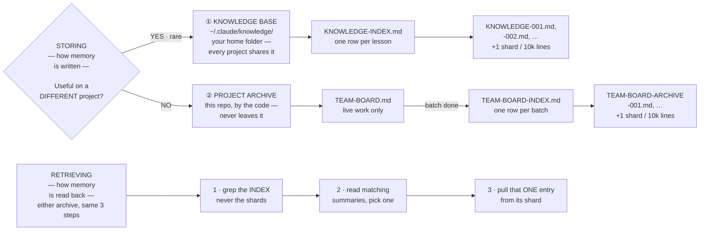

# Agentic Architecture

**A tiered, sharded memory archive for AI coding agents — at two levels — and the 14-role dev team that runs on it.**

AI agents forget everything when a session ends. The usual fix is a longer notes file, which works right up until the notes file *is* the problem: every agent has to read all of it before it can start, and it only ever grows.

This is the other fix. Both memories here are an **index plus shards** — a short list that's always read, pointing at cold storage that's never scanned. **The pile grows without bound; the cost of a lookup doesn't move.**

## It exists at two levels

| | ① **The knowledge base** | ② **The project archive** |
|---|---|---|
| **Lives in** | `~/.claude/knowledge/` — your home folder | each repo, beside the code |
| **Scope** | installed once — **every project shares it** | one set per project — **never leaves it** |
| **Holds** | lessons that hold on *any* codebase | what the team found, decided and shipped *here* |
| **Index** | `KNOWLEDGE-INDEX.md` — one row per lesson | `TEAM-BOARD-INDEX.md` — one row per finished batch |
| **Shards** | `KNOWLEDGE-001.md`, `-002.md`, … | `TEAM-BOARD-ARCHIVE-001.md`, `-002.md`, … |

One question routes everything: *would this help on a **completely different** project?* Yes — rare — it's a lesson, and it goes in your home folder where the next project will find it. No, and it's this project's business, so it stays in this repo.

Each entry is one row in its `-INDEX.md`; the full text sits in a numbered shard beside it, wrapped in `START`/`END` markers so it can be pulled out alone — **by marker, never by line number**, since a stored line number rots the moment anything above it is edited. Shards cap at 10,000 lines, and a write that would exceed that opens the next one; every index row carries its shard number, so lookups go straight to the right file however many exist. The archive grows sideways while the index stays one row per entry, and nothing is ever deleted — entries leave the index, not the pile.

They diverge after that: only the knowledge base compresses itself, records its own bad advice, and tracks whether it's being read.



### ① The knowledge base only

- **It compresses.** Every lesson has a `Category`. When five *new* ones land in one category, they're reviewed together and any overlap merges into a single lesson. The originals get `Status: superseded-by-KB-XXXX` — kept, but skipped by future searches. The index gets shorter as the pile gets longer.
- **It records its own bad advice.** A lesson that steers you wrong gets that written on itself, and its `Status` becomes `active ⚠1`. It can't be retrieved again without the warning attached. Only failures are recorded.
- **It knows if it's being ignored.** Every read is logged to `CONSULT-LOG.tsv` — by Claude Code, not by the AI — and checked whenever a new lesson is written.
- **One writer.** Only the top-level session writes to it. Subagents propose lessons in their reports; they never write. There's no file locking anywhere here, and concurrent writes to an index silently lose rows.

### ② The project archive only

While work is in flight, roles post findings for each other on `TEAM-BOARD.md` — that's how agents who share no memory hand things off. When a batch is finished, the director archives it and resets the board to empty.

**The reset is the only destructive step in the system**, so it's gated: the archive's slug set must match the shards' markers before the board is wiped. Verify the copy landed, *then* delete the original.

---

## The dev team that runs on it

The team is the part everyone builds. The archive is what makes it worth running twice.

```
                          engineering-director
                         /          |          \
                product-owner  project-manager  tech-lead
                                                    |
        ----------------------------------------------------------------
        |                    |          |             |               |
 senior-frontend-dev  senior-backend-dev  dba  security-engineer  devops-engineer
        |                    |
 junior-frontend-dev  junior-backend-dev

  ui-ux-designer            -> feeds specs into the frontend devs
  qa-engineer               -> verifies any implementation role
  technical-writer          -> documents shipped work
  code-refactoring-engineer -> cleans up after QA confirms behavior
```

Each role has a job description and rules about who to escalate to. The director assigns the smallest set the work needs — a one-line fix gets one person, not a committee — and is the only role that archives the board or reads the archive.

---

## What's in here

| | |
|---|---|
| `knowledge/` | The knowledge base's index, shipped empty |
| `skills/` | 19 playbooks — including the archive, retrieval and consolidation protocols |
| `agents/` | 15 job descriptions — the director plus the 14 roles it assigns |
| `CLAUDE.md.template` | The wiring that makes it all switch on |
| `tools/` | A checker that fails loudly when the docs and the rules disagree |
| `hooks/` | The logger that answers "is anyone actually reading this?" |

The knowledge base ships **empty on purpose**. It's meant to be earned — every row should be something your own sessions learned the hard way, not a preloaded list of best practices.

---

## Install

Everything installs to your home folder, so it works in **any** project afterwards.

```bash
git clone https://github.com/ynscancode/agentic-architecture.git
cd agentic-architecture

mkdir -p ~/.claude/agents ~/.claude/skills ~/.claude/knowledge

cp -r agents/* ~/.claude/agents/
cp -r skills/* ~/.claude/skills/
cp -n knowledge/KNOWLEDGE-INDEX.md ~/.claude/knowledge/   # -n: never overwrite an existing knowledge base
```

> **`cp -n` matters.** If you already have a knowledge base, a plain `cp` overwrites its index with this empty one and orphans every lesson in your shards. The two lines above it *do* overwrite same-named roles and playbooks — check for clashes first.

Then **merge** — don't overwrite — `CLAUDE.md.template` into `~/.claude/CLAUDE.md`. That's the wiring; without it everything is installed but asleep. (It ships as a `.template` so opening *this* repo in Claude Code doesn't apply it to itself.)

Optional — the read logger, needs `python`:

```bash
mkdir -p ~/.claude/hooks && cp hooks/log-kb-consult.py ~/.claude/hooks/
```

…then merge this into `~/.claude/settings.json`:

```json
{
  "hooks": {
    "PostToolUse": [{
      "matcher": "Read|Grep|Glob|Bash",
      "hooks": [{
        "type": "command",
        "command": "python ~/.claude/hooks/log-kb-consult.py 2>/dev/null || true",
        "async": true,
        "timeout": 10
      }]
    }]
  }
}
```

Nothing to install per-project — each project archive creates itself the first time the team touches that repo.

Check it landed with `ls ~/.claude/agents/ | wc -l` (15) and `ls -d ~/.claude/skills/*/ | wc -l` (19). Then give Claude something real that spans a few disciplines: you should see it route through `engineering-director`, bring in specialists in order, and run QA and security before calling it done.

---

## Keeping it honest

The playbooks in `skills/` are the source of truth; the job descriptions in `agents/` point at them instead of repeating them, because two copies of a rule always drift. Pointers break silently too, so a checker guards both directions and CI runs it on every change:

```bash
python tools/check_consistency.py       # 0 = fine, 1 = drifted, with file and line
python tools/test_check_consistency.py  # proves the checker still catches all 9 problems
```

The self-test exists because a check that has only ever passed is untested.

**This README isn't covered by it** — describing the system is a README's job, so it can't be pointer-only. It's kept accurate by hand, and can go stale.

---

## License

MIT — see [LICENSE](LICENSE).
